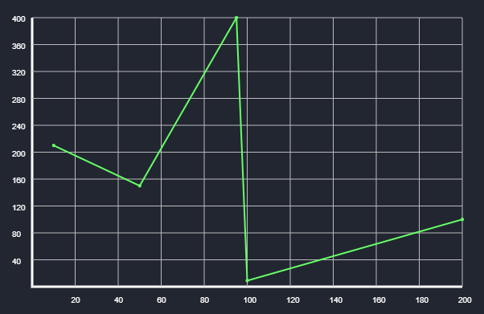

# Chart Line React

Simple lightweight easy to use line chart React component.



# Instalation and usage

    npm install chart-line-react

```js
import "./App.css";
import React from "react";
import LineChart from "./components/LineChart";

function App() {
  const data = [
    { x: 100, y: 9 },
    { x: 10, y: 210 },
    { x: 95, y: 400 },
    { x: 200, y: 100 },
    { x: 50, y: 150 },
  ];
  return (
    <div className="App">
      <LineChart data={data} />
    </div>
  );
}

export default App;
```

# Props

- `data` - array of objects following the format: `[{x: 10, y: 20}, {x: 35, y: 45'}]`
